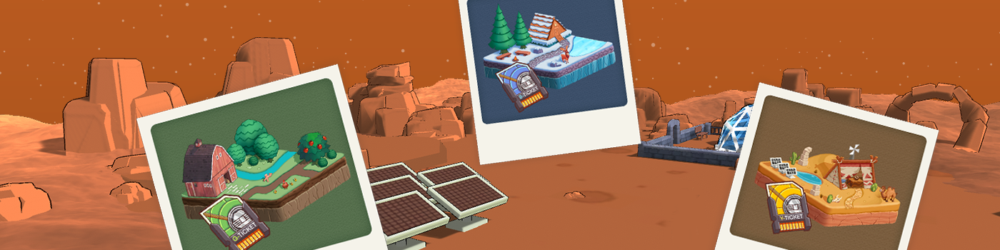

# Starship Ticket

Starship Ticket - Town Story Game Account Pass

Here is a Starship Ticket exclusively for the island on Centaur Planet! This is an entry NFT for the MyLand gameplay in the Town Story Galaxy game. You can plant crops, build factories, invite NPCs, go fishing, and more on the islands with three different temperatures. By completing various tasks and collecting materials, residents can DIY their own homes, expand their area, invite businesses to settle in, making their homes unique.

The Starship Ticket can take you from the relay station to your desired destination in the future, where you can create your own town. However, the destination may have different weather conditions, such as warm, cold, or hot, and the ticket will vary accordingly. Due to space limitations, it is not currently possible for everyone to freely choose their destination. The allocation of starship tickets will be determined through a lottery. However, those who already possess the portrait of Santo the Centaur will receive a ticket airdrop from Mr. Santo himself.

If players have multiple islands, each wallet address can choose only one island to bind in the game. If the user's wallet does not have any islands, they need to obtain the ticket again through the above methods.

If you want to get them, please visit here:  
&gt;&gt; [https://townstory.io/passcard](https://townstory.io/passcard)